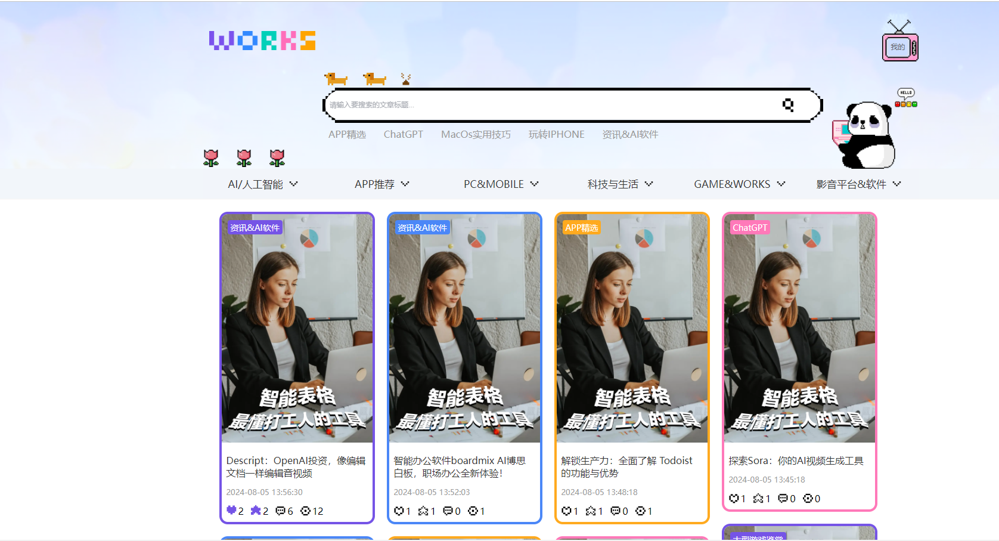
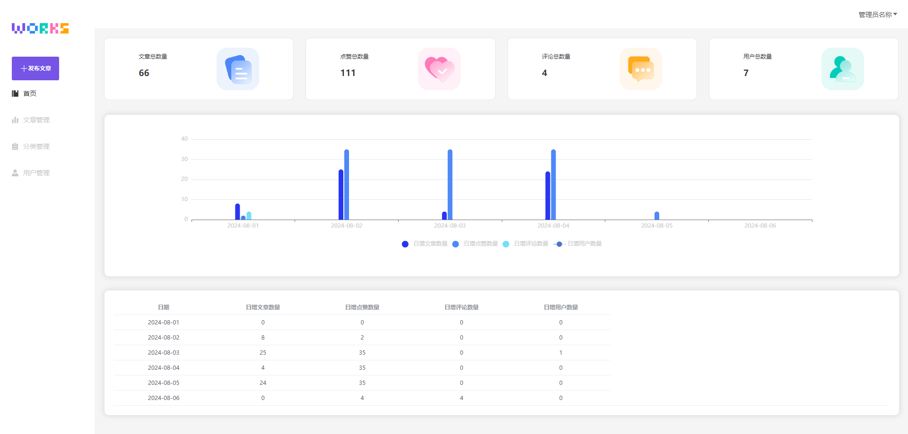

# 目录
1、项目源码简介
2、前台页面
3、后台页面
4、后端代码重要提醒

# 1、项目源码简介
1、skyworks后端项目源码
2、skyworks_web_front 前端项目源码
3、skyworks_web_back 后端项目源码
4、info_share.sql 数据库表格

# 2、前台页面

# 3、后台页面

# 4、后端代码重要提醒
**application.yml配置文件修改**
1、发送邮件授权码已进行修改，如果需要运行项目，请使用自己邮箱的授权码：
位置：application-dev.yml #授权码 password: xxxxxxxxxxxxxxxxx
2、application-dev.yml是本地运行配置文件，服务器上运行的是application-prod.yml，因为服务器部署在外网，所以邮箱用了gmail，如果想使用此配置文件，
同理需要自己申请授权码并填写上。
